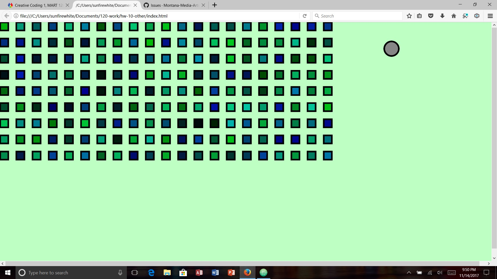

Kaitlin Clifford, 50

[Live Array Sketch](https://kaitlinclifford.github.io/120-work/hw-10-other/)

## HW-10 Response

This week started cool. I don't know why but this week I was able to comprehend alot more of the information from weeks 9 and 10 than I have prior. I feel like it's because we took "a week off" and didn't have homework so my brain could take a quick break, get my other homework done, and then really focus hard on coding.

# Problems

The only problem I really had was not being able to figure out the frameRate stuff. I asked about it on the issues board, but it was up there kind of late so I'm not sure if anyone will be able to help me out on this one, but maybe the next one.
Oh!!! And I still can't figure out the mousePressed thing. It never works when I want it to... I'm planning on going to office hours, I just always have class, or work, or other homework that doesn't allow me to go... I'll get there sometime.

# Progress

I'm going to be honest. This week was DEFINITELY not my best, and I'm disappointed that I wasn't able to put my best effort into this coding project. I know it will probably reflect in my grade for this one, which is understandable. Hopefully after Thanksgiving break, I can go to office hours and spend time understanding what I don't know. And coding is still really difficult for me, but I'm trying to get better at it.

# Overall Thoughts

I thought this week was fun to learn. When I read the information, and watched the videos I was able to understand it just fine. But when I tried to do the code on my own I had problems with things such as
- frame rates
- the mouse pressed function
- getting text to go into my code

