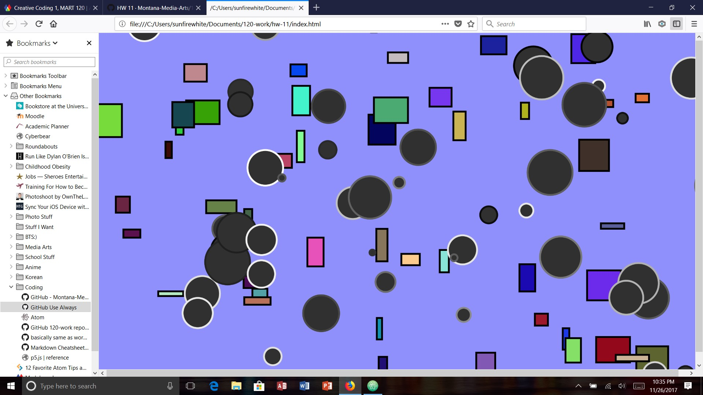

Kaitlin Clifford, 50

[Live Objects Sketch](https://kaitlinclifford.github.io/120-work/hw-11/)

## HW-11 Response

For this weeks homework, I started out by going into office hours which I feel really helped me. With this longer homework week, I was able to take my time and really make something that incorporated some of the other weeks stuff that I got help understanding at office hours. And I feel like my homework this week is pretty cool, especially since I understood most of what was involved.

# Problems

I didn't really have any problems this week. I was going through my code and named my class different than the stuff just below the for loop, and realized that's what was making my code not work. I also tried to used modulo for more than one class, and I'm not really sure if it worked. I think it did, but not the way I wanted.

# Progress

Weeks coming up to now have been difficult. But I felt that I did slightly better this week than most. I thought that what I made was pretty cool, so I'm happy with my progress for this week.

# Overall Thoughts

Overall this week turned out pretty good. I'll probably keep going to office hours when I need help because it seemed to go well for me. It was cool to learn about classes this week because it seemed to make coding a tad bit more collective and less messy which was nice.

