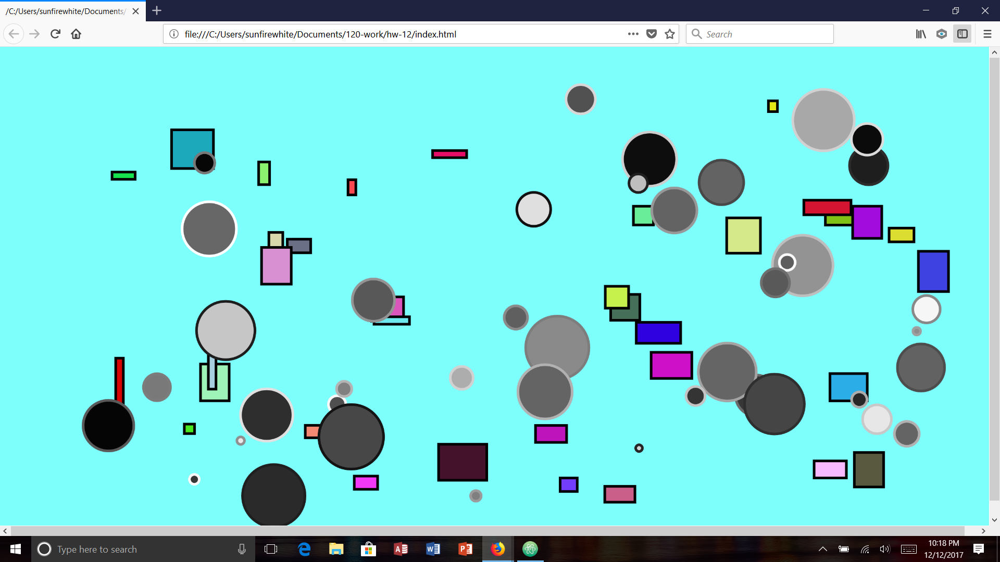

Kaitlin Clifford, 50

[Live Interacting Objects Sketch](https://kaitlinclifford.github.io/120-work/hw-12/)

## HW-12 Response

For this weeks homework, the final homework, I wanted to create something cool. I definitely thought I made somethihng cool. It wasn't what I wanted but I definitely think it's cool. I'm a little disappointed with what I've made, but overall I thought I did a good job.

# Problems

Some problems I faced throughout this homework were when I was trying to make the code do what I wanted. I wanted it to be like the example where the shapes hit the wall and then changed color. I tried following the example, but then instead of bouncing off the walls, they just went off the screen. However, I was able to make a cool effect where the shapes look like they're being sucked off the screen so that's cool.

# Progress

Overall, I thought I did a good job in finding something cool that I could do with the homework so I'm happy with it, just kind of disappointed in myself because I couldn't do what I truely wanted.

# Overall Thoughts

So this semester I learned alot. These last two weeks have been really helpful because of the classes. I've learned alot of things this semester that I had no idea how to do before, and I feel like I've improved with each sketch that I've made. And even if I couldn't figure out how to make the sketch the way I wanted, I made something cool out of what I could do.

