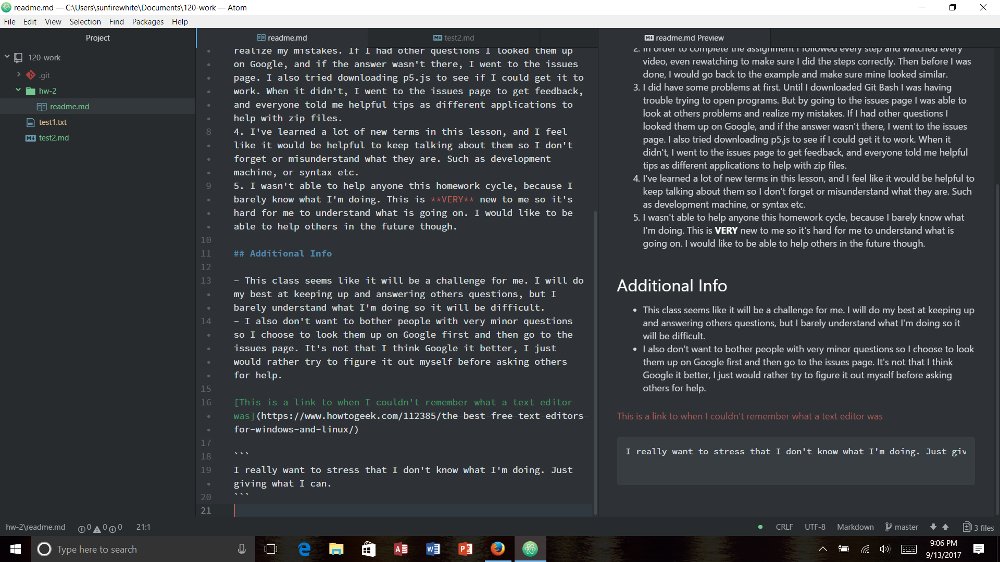

Kaitlin Clifford 50

# This Weeks Homework Answers

1. For this weeks homework cycle, I **procrastinated a lot** which wasn't smart of me. So I followed the steps we took through each phase of the lesson. It was difficult for me to follow along at points because I didn't understand what was being talked about, but I would look things up online and I figured it out along the way. Going to the issues page on GitHub was also helpful if others had the same problems as me.
2. In order to complete the assignment I followed every step and watched every video, even rewatching to make sure I did the steps correctly. Then before I was done, I would go back to the example and make sure mine looked similar.
3. I did have some problems at first. Until I downloaded Git Bash I was having trouble trying to open programs. But by going to the issues page I was able to look at others problems and realize my mistakes. If I had other questions I looked them up on Google, and if the answer wasn't there, I went to the issues page. I also tried downloading p5.js to see if I could get it to work. When it didn't, I went to the issues page to get feedback, and everyone told me helpful tips as different applications to help with zip files.
4. I've learned a lot of new terms in this lesson, and I feel like it would be helpful to keep talking about them so I don't forget or misunderstand what they are. Such as development machine, or syntax etc.
5. I wasn't able to help anyone this homework cycle, because I barely know what I'm doing. This is **VERY** new to me so it's hard for me to understand what is going on. I would like to be able to help others in the future though.

## Additional Info

- This class seems like it will be a challenge for me. I will do my best at keeping up and answering others questions, but I barely understand what I'm doing so it will be difficult.
- I also don't want to bother people with very minor questions so I choose to look them up on Google first and then go to the issues page. It's not that I think Google is better, I just would rather try to figure it out myself before asking others for help.

[This is a link to when I couldn't remember what a text editor was](https://www.howtogeek.com/112385/the-best-free-text-editors-for-windows-and-linux/)

```
I really want to stress that I don't know what I'm doing. Just giving what I can.
```


