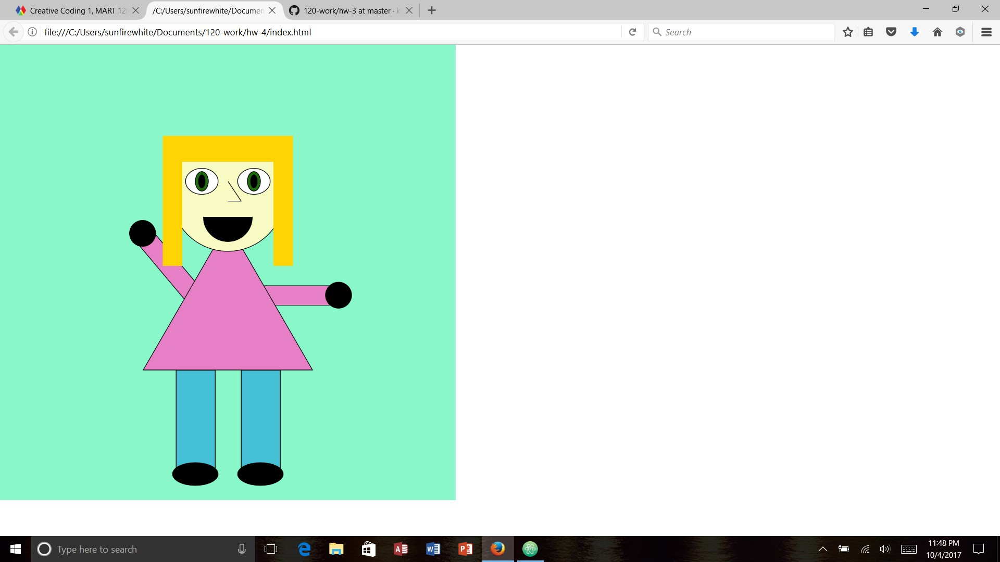

Kaitlin Clifford, 50

Self portrait

## HW-4 Response

This week started out alright. After figuring out where I went wrong last week with my homework and going to the office hours, I was able to really understand the homework and how to upload things on github. This weeks homework seemed really fun, and I thought I was going to be super creative. However, after looking at the other people's homework assignments, I realized I'm less creative with this assignment than I could have been. But overall, I thought that I worked hard on this assignment so I'm proud of what I did.

# Problems

Suprisingly I didn't have any problems with this weeks homework. I mean sure it was a bit difficult to figure out where to place all the shapes and how to use the x and y coordinates in order to place the shapes where I wanted them. I can't really figure out the rotate function so I think I need to look that up and really understand it better.

# Progress

I made a portrait that I'm proud of, and hoping that I don't screw it up when I upload it. But if I do screw it up, it should be ok because I kind of know what I'm doing now so I can get everything back on track. I might even save an extra copy just in case.

# Overall Thoughts

Overall this week was pretty good in this class. I was glad that I was able to go to office hours and figure out what had happened last week. Even though I didn't use the issues page this week, it was good to read other people's issues in case things were to go wrong for me.

- I would like to keep using office hours because that will really help me if I have issues.
- I would like to help others more on the issues board if I can, because I want to be useful even if I don't know what I'm doing.

# Final Sketch of HW-4

