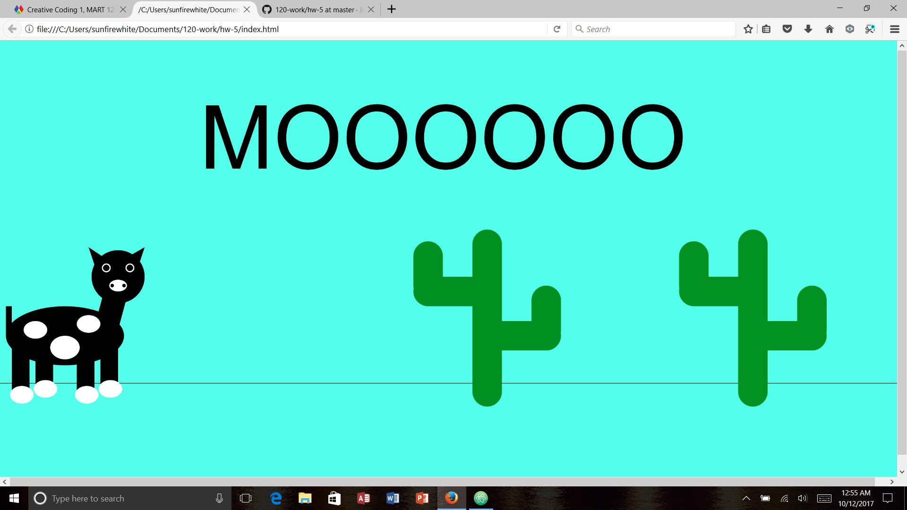

Kaitlin Clifford, 50

Live Animation Sketch

## HW-5 Response

This week was cool to learn about all these different things that I could do with code. I loved learning that you can make things move around with the cursor because I would spend all day making designs from doing that if I could. This homework assignment started out good for me. It was hard to figure out what type of animation I wanted to create, but then soon figured it out. I looked at other people's assignments and learned that I am not very creative, but I'm still trying my best. Since coding is still very new and tricky for me, I feel I'm doing well.

# Problems

I definitely did have some problems this week. Mostly with trying to get the "MOOOOOO" text to move with the cursor. I finally got it after trying many a time, but it made me really happy when I figured it out. I'm also having trouble understanding some of the math parts of variables, so I think I will need to go study more on that part.

# Progress

I'm not 100% satisfied with my sketch. I feel like if I would have spent more time on it, I could have made it better! But from what I have done I think I'm learning well and creating cool material.

# Overall Thoughts

Overall, this week was cool. I really enjoy watching Dan's videos because they seem to help me understand even better. If I need extra help, I try to go to the issues board to see if others have had the same problems, and if not, I like to use Google. If I could spend more than one week working on a project, I think I would be able to create a much better sketch, but given the time I have, I had a pretty good time making my sketch.

