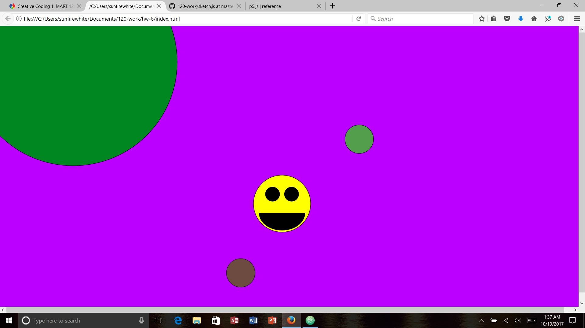

Kaitlin Clifford, 50

arithmatic sketch

## HW-6 Homework Response

This week it was cool to learn that you can do all sorts of new tricks with math. It was really difficult to figure everything out but I got it handled. This homework assignment started out rough for me. I couldn't remember how to even start this sketch. This week overall was rough to do but I was able to get over the rough patch. However, I feel silly because I'm way less creative when it comes to this kind of stuff and so when I look at other's works, I want to make mine better, but it never works that way.

# Problems

I was glad when people were having problems and I could go look at the issues page to see how they figured it out. However, I ran into alot of issues when trying to create this sketch. It was mainly from trying to look at the examples and then figure out what I wanted to do from that. And I lack in what I can do since I have trouble thinking outside the box for ideas for the sketches. I will try harder to make the next one even better.

# Progress

This week's progress was slow, and painful. I was able to get most of the sketch done fairly easily, but had problems with some of the new concepts. I will also try to be more creative in my sketches because I feel like I'm failing at being creative.

# Overall Thoughts

Overall this week turned out to be rough for me. These are all of the things I want to work on so that I can make the rest of this semester go smooth.
- creativity
- thought process
- stop procrastinating so work is better
- getting homework done without problems

All of these things will definitely help me in the future when doing homework assignments.

