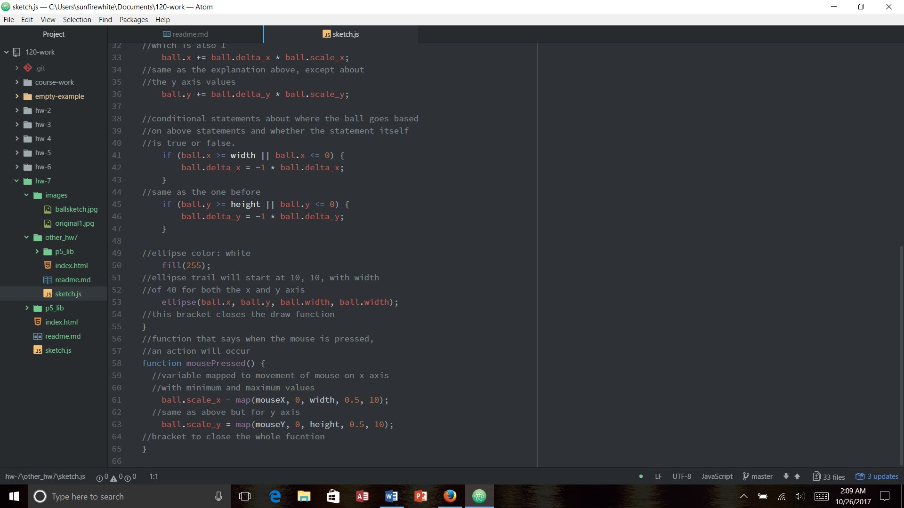

Kaitlin Clifford, 50

[Live Sketch Link](https://kaitlinclifford.github.io/120-work/hw-7/)

# HW 7 | Describe then Alter the Bouncing Ball

## Description of What the Original Code is Doing

In this original code, the ball is moving across the screen, and changing direction everytime it hits an edge of the screen. If the mouse is pressed, the ball changes speed, and if pressed in a certain spot on the screen, the ball changes direction.

 Why is it working the way it is?

- The conditional statements and variables set up whether or not certain conditions for the block will be met or not. We use if, else, true, false, mousePressed, and mouseIsPressed statements to help set up the conditions.

 How can you make the ball change direction?

- You make the ball change direction based on the code, and where you click on the screen. Because of the mousePressed function, we can change the direction based on the clicked x and y coordinates of the mouse.

What does each line do

## How did you alter the sketch?

For this sketch, I changed the background to have different colors based on where the mouse is. I made it so the ball is bigger in size. I've added text that says "Click the Mouse" to let people know things change if you do that. Then I made the ball change colors if the mouse is clicked and held.

## HW-7 My Changed Code Homework Response

This week started out well. I enjoyed learning about this week better than most because it was fairly easy to comprehend. It was fun to add the mousePressed functions and the mouseIsPressed functions because they both do different things which makes the sketch cool.

# Problems

I did have some problems this week. It wasn't really anything that needed to go on the issues board. But I'm confused. Are you able to use the mousePressed function more than once in your sketch? I couldn't make it work for me, and I was getting frustrated so decided against trying to put it in. Also, I don't really understand this whole section:

ball.x += ball.delta_x * ball.scale_x;
ball.y += ball.delta_y * ball.scale_y;

if (ball.x >= width || ball.x <= 0) {
  ball.delta_x = -1 * ball.delta_x;
}
if (ball.y >= height || ball.y <= 0) {
  ball.delta_y = -1 * ball.delta_y;
}
I'm only confused about it because I don't know what it changes if you change the numbers in the variables.

# Progress

I will go on youtube and watch some more videos about coding and hopefully be able to figure it out. Shouldn't be that difficult if I really study the lesson, and find some videos to watch about this week.

# Overall Thoughts

Overall, I thought this week was fun. I really don't know how well I'm liking coding. I try to come up with creative ideas, but I'm limited by my expertise to actually make it good. I say this all the time, but I feel that each week I get better.

