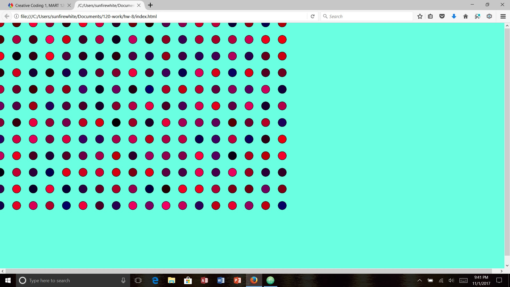

Kaitlin Clifford, 50

[Live Loops Sketch](https://kaitlinclifford.github.io/120-work/hw-8/)

## HW-8 Homework Response

This week started out well. I was very happy with the way this week ended up. It was really fun learning about loops and all of the things we can do with them. I was especially happy with how my sketch came out this week. The last couple of weeks haven't been awesome in the sketch department for me, but I was really happy.

# Problems

The only problem I really had was not being able to do the sketch the way I had originally intended. I made something else that was just as cool, but I wanted the squares to change to circles when the mouse was pressed and I couldn't figure that out. Probably will go into office hours to figure that out.

# Progress

I'm glad this week was a "catch up" week. It let me take a look at a few things I was confused on, and made me less confused. Coding is still really difficult for me, but I'm getting better.

# Overall Thoughts

I thought this week was one of the best weeks I've had in coding. I really enjoyed things such as
- looping
- making the squares and ellipses follow the mouse
- getting the shapes to change color at random and make them look super cool

